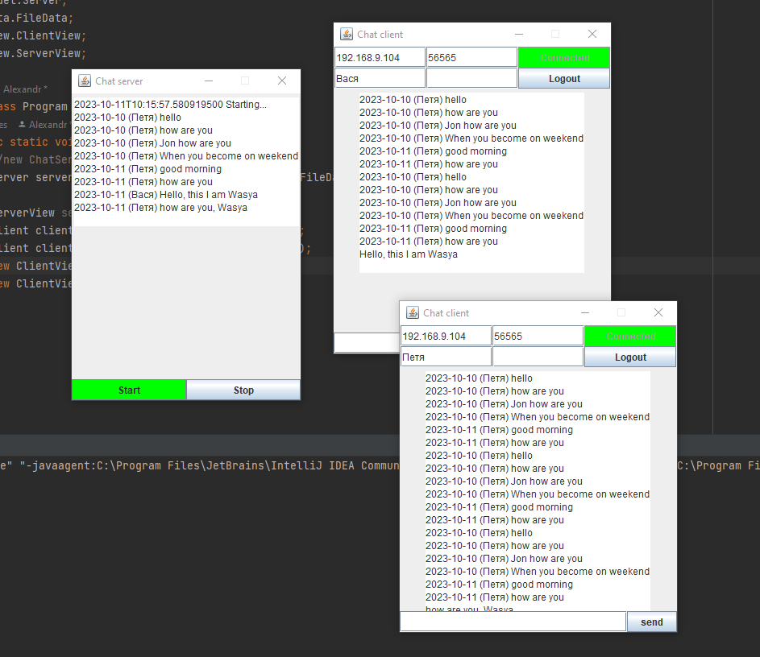

## Сервер мессенджера
## Собрать графический интерфейс проекта месседжера
* Отправлять сообщения из текстового поля сообщения в лог по нажатию кнопки или по нажатию клавиши Enter на поле ввода сообщения;
* При запуске клиента чата заполнять поле истории из файла, если он существует.
* Обратите внимание, что чаще всего история сообщений хранится на сервере
* и заполнение истории чата лучше делать при соединении с сервером, а не при открытии окна клиента.

